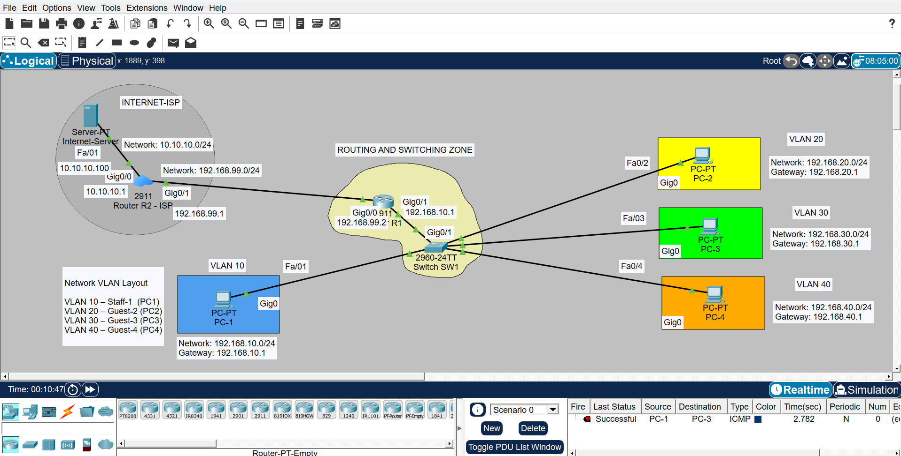

# Cafe_Network

A Cisco Packet Tracer project that simulates a cafe network infrastructure using VLANs, Inter-VLAN Routing, and ISP connectivity.

## Features

- VLAN Segmentation
- Inter-VLAN Routing
- Router-on-a-Stick Configuration
- IP Addressing & Subnetting
- Internet Connectivity Simulation
- Routing & Switching Concepts

## Network Layout

The network consists of:

- VLAN 10 – Staff
- VLAN 20 – Guest-1
- VLAN 30 – Guest-2
- VLAN 40 – Guest-3

Each VLAN is configured with its own subnet and default gateway.

## Network Topology

## Technologies Used

- Cisco Packet Tracer
- Networking Fundamentals
- Routing & Switching
- VLAN Configuration

## Author

Adnan Ali
